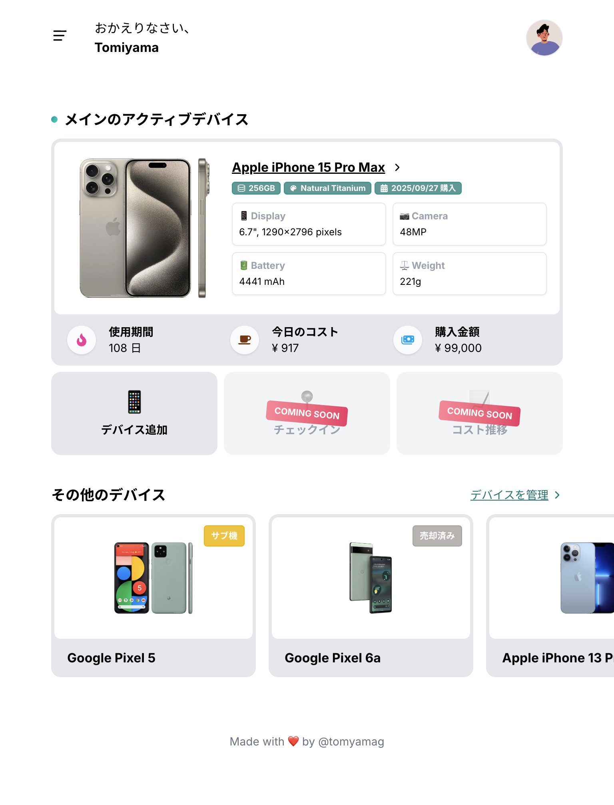
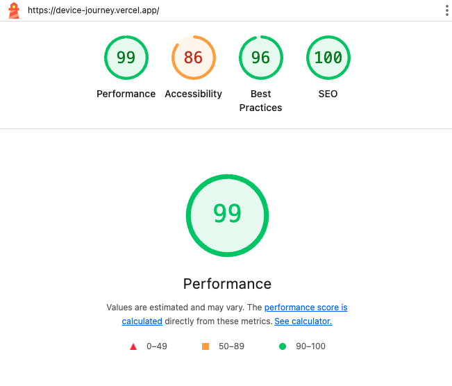
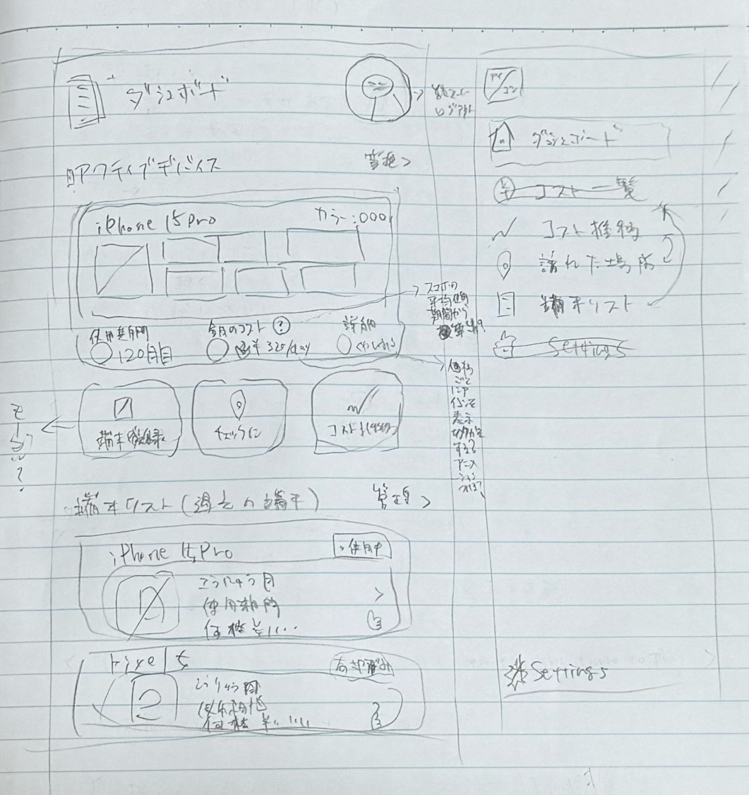

# Device Journey 📱

これまでのモバイル端末の遍歴を記録・管理するアプリケーション。  
「あの時、何のスマホ使ってたっけ？」をなくし、愛機たちとの思い出をログとして残すことができます。

## 概要

手持ちのスマホを登録し、購入日やメイン端末としての利用状況、かかったコストなどを管理できるアプリです。  
Supabase をバックエンドに採用し、Next.js / App Router と Server Actions を活用した構成で構築しました。

### スクリーンショット

<div align="center">
  
</div>

### URL

https://device-journey.vercel.app/

#### テストアカウント（登録情報あり）

| メールアドレス   | パスワード       |
| ---------------- | ---------------- |
| user@example.com | R+bj\*vD2&zYf?.- |

#### テストアカウント（登録情報なし）

| メールアドレス    | パスワード       |
| ----------------- | ---------------- |
| empty@example.com | Wq-J!\*ZJkW$$-S8 |

## 機能

### 高度なデバイス検索

- 外部 API と連携し、15,000 件以上のデータベースからリアルタイムに検索可能
- オートコンプリート（サジェスト）機能により、正式名称が曖昧でもスムーズな入力を実現

### スマートな情報登録フロー

- 検索結果からスペック・画像を自動反映し、ユーザーの手入力を最小限に抑制
- デバイス固有のカラーやストレージ容量の選択肢を動的に生成

### デバイス資産管理

- 購入日・金額に加え、売却時のデータも記録可能としライフサイクル全体を管理
- メインデバイス・サブ機・指定なしのステータス設定が可能（メインデバイスはダッシュボードで優先表示）

### ユーザー認証

- Supabase Auth を採用したメールアドレス／パスワード認証

## 技術スタック

### フロントエンドコア

- Next.js 16 / App Router
- TypeScript

### CSS フレームワーク

- Tailwind CSS

### 状態管理

- TanStack Query
- Zustand

### データソース／API 連携

- [MobileAPI](https://mobileapi.dev/)

### フォーム／バリデーション

- React Hook Form
- Zod

### コンポーネント／ユーティリティー

- Swiper
- Sonner
- Headless UI
- React Icons
- Day.js

### バックエンド／インフラ

- Supabase
- Vercel

### コード品質管理

- ESLint
- Stylelint
- Prettier

## アーキテクチャについて

### 外部 API 連携とデータ永続化フロー

ユーザーの入力負担を減らすため、[MobileAPI](https://mobileapi.dev/) を導入しました。

#### オートコンプリート

ユーザーが入力中にリアルタイムで API を叩き、サジェストを表示することで検索体験を向上させています。

#### データ整形とブリッジ

検索して選択されたデバイス情報は、Zustand ストアを経由する際に API のデータ形式から Supabase のテーブル構造形式へと正規化されます。  
これにより、登録フォームに遷移した時点で入力完了状態を作り出し、ユーザーは「検索 → 即保存」というスムーズな体験が可能です。

### 状態管理の明確な責務分離

データのキャッシュ（サーバーの状態）と UI・編集中の状態（クライアントの状態）を明確に分けて管理しています。

#### TanStack Query

DB データのフェッチだけでなく、MobileAPI への検索リクエストのキャッシュや、入力時のデバウンス制御とも連携しています。

#### Zustand

前述のデータブリッジとしての役割を担当しています。

### アクセシビリティとデザインの分離

UI コンポーネントの実装には一部で Headless UI を採用しました。  
複雑なキーボード操作やフォーカス管理といったロジックはライブラリに任せ、スタイリングは Tailwind CSS で制御する設計です。

### 堅牢なフォーム設計

#### React Hook Form

不要な再レンダリングを抑え、入力時のパフォーマンスを最適化しました。

#### Zod

スキーマ定義による厳格なバリデーションと、TypeScript の型推論による安全性を担保しています。

## Lighthouse 計測スコア

<div align="center">
  
</div>

## ラフスケッチ

<div align="center">
  
</div>

## ローカル開発環境

### インストール

#### macOS

- [nodenv](https://github.com/nodenv/nodenv)

#### Windows

- [nodist](https://github.com/nodists/nodist)

#### VS Code Extensions

- [EditorConfig for VS Code](https://marketplace.visualstudio.com/items?itemName=EditorConfig.EditorConfig)
- [Prettier - Code formatter](https://marketplace.visualstudio.com/items?itemName=esbenp.prettier-vscode)
- [ESLint](https://marketplace.visualstudio.com/items?itemName=dbaeumer.vscode-eslint)
- [Stylelint](https://marketplace.visualstudio.com/items?itemName=stylelint.vscode-stylelint)

### セットアップ

```sh
npm i
```

### 開発

#### 環境変数の作成

```sh
cp .env.example .env.local
```

#### 起動

```sh
npm run dev
```

http://localhost:3000
