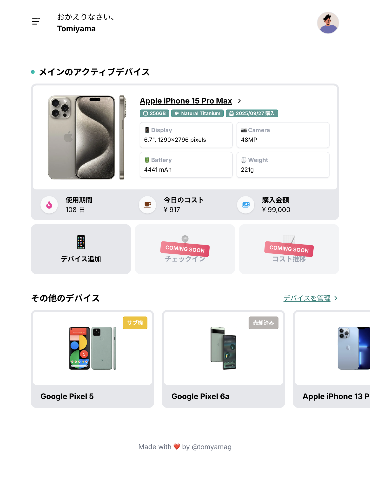
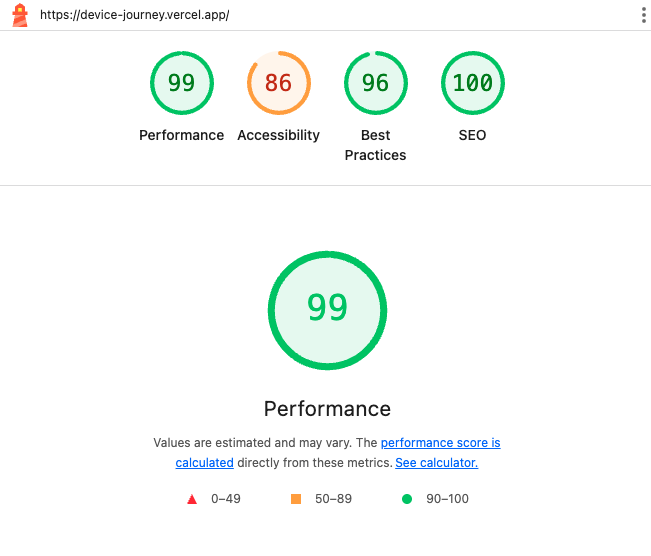
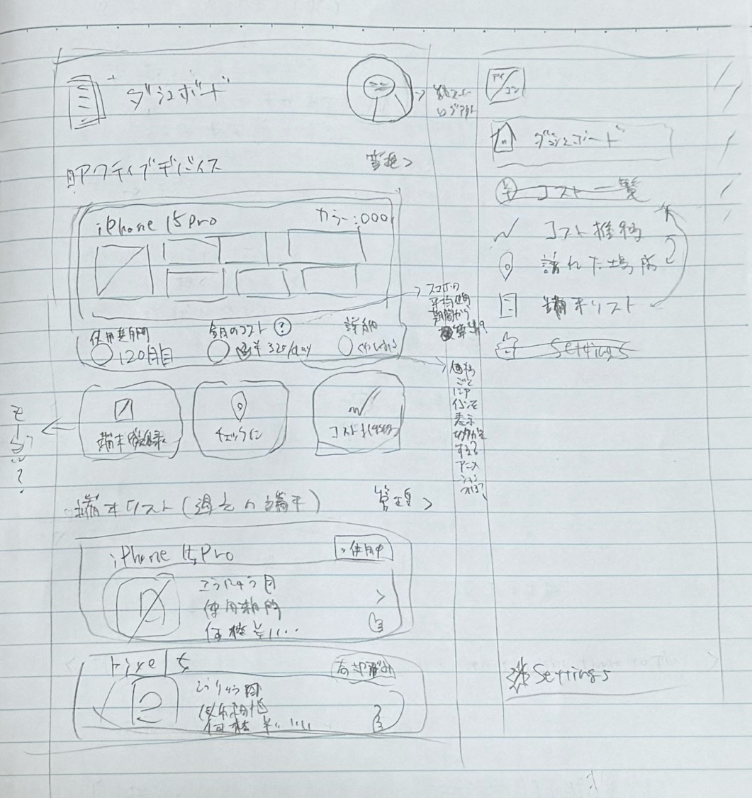

# Device Journey

これまで使用してきたモバイル端末の遍歴を記録・管理するアプリケーション。  
「あの時、何のスマホを使ってたっけ？」をなくし、愛機たちとの思い出をログとして残すことができます。

## 概要

手持ちのスマホを登録し、購入日やメイン端末としての利用状況、かかったコストなどを管理できるアプリ。  
Supabase をバックエンドに採用し、Next.js (App Router) と Server Actions を活用した構成で構築。

### スクリーンショット

<div align="center">
  
</div>

### URL

https://device-journey.vercel.app/

#### テストアカウント（登録情報あり）

| メールアドレス   | パスワード       |
| ---------------- | ---------------- |
| user@example.com | R+bj\*vD2&zYf?.- |

#### テストアカウント（空アカウント）

| メールアドレス    | パスワード       |
| ----------------- | ---------------- |
| empty@example.com | Wq-J!\*ZJkW$$-S8 |

## 機能

### デバイス検索

- 外部 API と連携した端末検索
- オートコンプリートによる検索サジェスト

### デバイス登録

- 検索結果からスペック・画像の自動反映
- カラー・ストレージ容量の動的生成
- 最小限の入力で登録可能なフォーム構成

### デバイス管理

- 購入日・購入金額・売却金額の記録
- メイン端末・サブ端末のステータス管理
- メイン端末のダッシュボード優先表示

### ユーザー認証

- Supabase Auth によるメールアドレス認証

## 技術スタック

### フロントエンドコア

- Next.js 16 (App Router)
- TypeScript

### CSS フレームワーク

- Tailwind CSS

### 状態管理

- TanStack Query
- Zustand

### 外部 API

- [MobileAPI](https://mobileapi.dev/)

### フォーム / バリデーション

- Conform
- Zod

### UI / ユーティリティ

- Headless UI
- Sonner
- Swiper
- React Icons
- Day.js

### バックエンド / インフラ

- Supabase
- Vercel

### コード品質

- ESLint
- Stylelint
- Prettier

## アーキテクチャ

### 外部 API 連携とデータ整形レイヤー

デバイス検索には MobileAPI を使用。  
MobileAPI のレスポンス形式と Supabase テーブル構造には差異が存在するため、Zustand を経由したデータ整形レイヤーを配置。

API レスポンスをアプリ内部のデータ構造へ変換し、登録フォームへそのまま渡せるデータ形式へ正規化。  
検索 → 登録画面遷移時点で入力済み状態を生成する構成。

### 状態管理

サーバー状態とクライアント状態の責務分離。

#### TanStack Query

外部 API の検索結果を管理。

- API リクエスト管理
- キャッシュ管理
- リクエスト制御

#### Zustand

登録フォームへ渡すデバイスデータを管理。

- API レスポンス整形
- 画面間データ受け渡し

### UI コンポーネント設計

アクセシビリティロジックとスタイリングの分離をするため、UI の一部には Headless UI を採用。

- キーボード操作
- フォーカス管理
- ARIA 対応

スタイリングは Tailwind CSS による制御。

### 堅牢なフォーム設計

#### Conform

Server Actions と統合したフォーム管理により、クライアント・サーバー間のバリデーションを統合。

#### Zod

スキーマ定義による厳格なバリデーションと、TypeScript の型推論による安全性を担保。

## Lighthouse 計測スコア

<div align="center">
  
</div>

## ラフスケッチ

<div align="center">
  
</div>

## ローカル開発環境

### インストール

#### macOS

- [nodenv](https://github.com/nodenv/nodenv)

#### Windows

- [nodist](https://github.com/nodists/nodist)

#### VS Code Extensions

- [EditorConfig for VS Code](https://marketplace.visualstudio.com/items?itemName=EditorConfig.EditorConfig)
- [Prettier - Code formatter](https://marketplace.visualstudio.com/items?itemName=esbenp.prettier-vscode)
- [ESLint](https://marketplace.visualstudio.com/items?itemName=dbaeumer.vscode-eslint)
- [Stylelint](https://marketplace.visualstudio.com/items?itemName=stylelint.vscode-stylelint)

### セットアップ

```sh
npm i
```

### 開発

#### 環境変数の作成

```sh
cp .env.example .env.local
```

#### 起動

```sh
npm run dev
```

http://localhost:3000
